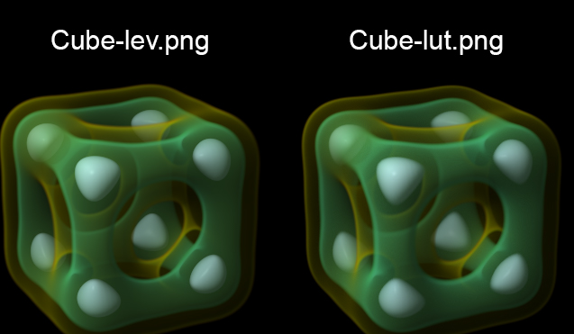
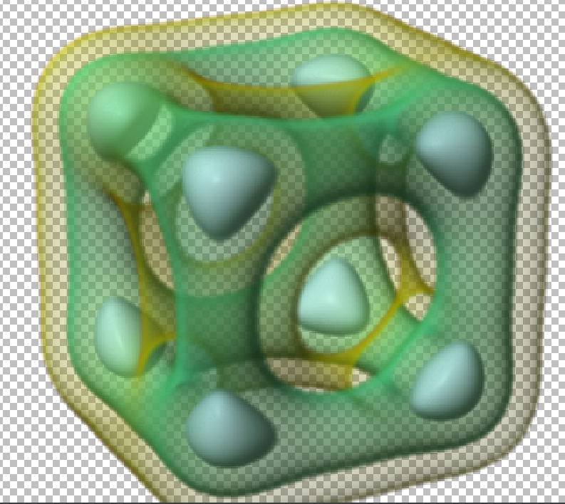

# Goal of Gorendr
Our goal is to implement a subset of the p3rendr library introduced in CMSC 37710. The library is to combine 3D convolution with elements of graphics (a simple camera model, the over operator, and Blinn-Phong shading) to complete a tool that can make high-quality renderings of volume (3D image) datasets. The original library is written in C, and we hope to use Golang to achieve the same functionality. More specifically, we hope to achieve the following command. All the input files will be assumed to exist.
```bash
PARMS="-fov 14 -us 0.03 -s 0.01 -k ctmr -p rgbalit -b over -lit $SCIVIS/lit/1.txt -dcn 1.1 1.1 1.1 -dcf 0.4 0.4 0.4"
./rendr go @cube-cam.txt -i cube.nrrd $PARMS -nt 4 \
    -lut cube-luta.nrrd -o cube-lut.nrrd
./rendr go @cube-cam.txt -i cube.nrrd $PARMS -lut cube-lut1.nrrd -nt 4 \
    -lev $SCIVIS/cmap/cube-levoy3.txt -o cube-lev.nrrd
overrgb -i cube-lut.nrrd -o cube-lut.png
overrgb -i cube-lev.nrrd -o cube-lev.png
open cube-{lut,lev}.png
```
The effect of the above commands is to render the following two images:


We chose Golang to implement the render mainly because of two things: 
- Golang's multithreading power is second to none, and in this scenario, each ray is independent of the others, and many computations can be done parallelly.
- We can use the package `Gonum` to handle all the matrices and linear algebra, which can be cleaner than using all kinds of macros in C.
- We have the core package `image` to handle the pixel-wide image processing.
- Golang is famous for its simplicity and cleanliness, and it can achieve high performance. We hope to investigate how large the overhead Golang has compared to C.

## Tasks
1. Deal with the command line arguments, correctly parse the input and save everything to its place.
2. understand the NRRD file and correctly parse it.
3. Handle the kernel evaluation, just `ctmr` for now.
4. Implement the rendr algorithms

## Results

Our version of rendering: we modified the parameters a bit for simplicity. First of all, use Python's pynrrd package to parse the `NRRD` files and save the data into `npy` format. We found a package `npyio` that is written in Go. Moreover, we simplified the lights to be only one light, and only support the `rgbalit` and `rgba` mode. For now the we only wrote `ctmr` kernel, but adding more kernels is just a matter of time. The testing command is shown below.
```bash
./rendr go -fr 6 12 5 -at 0 0 0 -up 0 0 1\
    -nc -2.3 -fc 2.3 -fov 20\
    -sz 320 280 -id cube.npy -im cube-meta.npy \
    -fov 14 -us 0.03 -s 0.01 -k ctmr -p rgbalit -b over \
    -lit "1 1 1 -1 1 2 1" -dcn 1.1 1.1 1.1 -dcf 0.4 0.4 0.4\
    -nt 4 -lutd cube-luta.npy -od cube-lut.png
```
We render the image directly in Go using the `image` library instead of bothering the `NRRD` format. We didn't set the background to black but instead, we left it transparent. Following the tradition of representing transparency in Photoshop, the output image is shown here:

